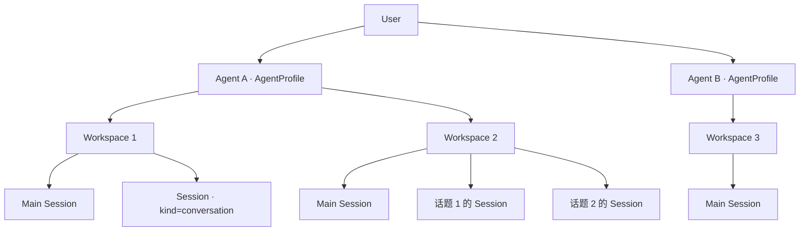

# HappyClaw 业务模型

本文记录用户确认的业务规则，作为实现、界面与验收的依据。历史字段名、自动绑定行为和旧设计文档不能覆盖这些规则。

## 层级与术语

**User → Agent → Workspace → Sessions**。一个用户可以拥有多个 Agent，一个 Agent 可以拥有多个 Workspace；每个 Workspace 恰好属于一个同用户的 Agent，每个 Session 恰好属于一个 Workspace。

| 业务概念     | 内部表示                                                                                           | 归属与含义                                                                                                     |
| ------------ | -------------------------------------------------------------------------------------------------- | -------------------------------------------------------------------------------------------------------------- |
| User         | `users`                                                                                            | 拥有自己的 Agent、Workspace 及其会话；管理员身份不等于其他用户资源的所有权。                                   |
| 顶层 Agent   | `AgentProfile`、`agent_profiles`                                                                   | 承载身份、提示词及能力策略；可以拥有多个 Workspace。创建 Agent 本身不隐式创建 Workspace 或渠道绑定。           |
| Workspace    | `workspaces`；兼容 `registered_groups` 的 `web:*` 记录；`workspace_agent_profiles` 记录 Agent 归属 | 是 Agent 下的工作空间。迁移只能在同用户的 Agent 之间进行，不能继续使用旧 Agent 的活动运行时或冒认其 SDK 身份。 |
| Main Session | Workspace 的主会话，通常以 Workspace 的 `web:*` JID 寻址                                           | 也是 Session，可以被私聊或普通群显式绑定；绑定主会话不等于把渠道绑定到整个 Workspace。                         |
| 其他 Session | `agents` 中 `kind='conversation'`；TypeScript 历史类型名为 `SubAgent`                              | 是 Workspace 下的业务会话，**不是顶层 Agent**。保留内部类型名不改变产品含义。                                  |
| SDK 运行状态 | `sessions`、`workspace_runtime_sessions`                                                           | 保存 SDK session ID、Provider 和 Agent 身份版本等恢复信息；这些记录不是新的顶层 Agent，也不构成渠道绑定。      |
| 渠道账号     | `channel_accounts`                                                                                 | 用户连接的 Bot/渠道身份。连接成功、发现会话、归属同一用户或 Workspace，均不自动授权回复。                      |
| 渠道绑定     | `channel_mounts`、`agent_channel_mounts` 等绑定记录                                                | 明确指定渠道会话的目标 Session，或话题群的目标 Workspace；是否绑定不能仅凭账号连接状态或目录归属推断。         |

`SubAgent` 的 task/spawn 等执行角色也不能与顶层 `AgentProfile` 混称。Home Workspace 固定属于同一用户的内置 HappyClaw Agent。

## 飞书绑定规则

| 渠道会话类型 | 必须显式绑定的对象              | 会话分配规则                                                                                  |
| ------------ | ------------------------------- | --------------------------------------------------------------------------------------------- |
| 私聊         | 一个 Session，允许 Main Session | 消息进入指定 Session。已有有效的 Main Session 绑定无需因“私聊”身份重新挂载。                  |
| 普通群       | 一个 Session，允许 Main Session | 消息进入指定 Session；提及或激活策略不会把普通群变成 Workspace 绑定。                         |
| 话题群       | 一个 Workspace                  | 在该 Workspace 内，每个原生话题对应一个独立 Session；同一话题复用其 Session，不同话题不合并。 |
| 未绑定会话   | 无                              | 保持可发现、可供用户选择绑定，但不启动 Agent 回复，也不发送确认、兜底答复或自动镜像。         |

单独存在 Workspace 归属、默认 Workspace、历史消息、账号连接或自动发现记录，都不等于有效渠道绑定。解绑必须真正移除投递关系，后续消息不会自动恢复到默认 Workspace 或其他 Session。绑定检查先于回复执行；历史关联信息不能绕过解绑。

Main Session 的兼容表示可能使用空的子会话 ID，因此应结合显式绑定记录和路由模式判断目标，不能把“没有子会话 ID”直接解释为未绑定或话题群绑定。

## 回复归属

每条用户输入拥有自己的回复来源。一个 Session 可以接收来自不同入口的输入，但回复目标必须随这条输入确定，不能由“第一个渠道 owner”“最近一个 IM 来源”或共享 Workspace 推导。

| 输入来源         | 本次回复目标                                                    |
| ---------------- | --------------------------------------------------------------- |
| Web              | 对应 Web Session；不因该 Session 同时绑定 IM 而自动向 IM 发送。 |
| 飞书私聊或普通群 | 收到该输入的同一渠道账号、同一原生会话。                        |
| 飞书话题         | 收到该输入的同一渠道账号、群及原生话题。                        |

来源不同的输入不能合并成一个只有单一回复目标的执行批次。流式输出、`send_message`、最终答复及延迟回调都必须保留本条输入的来源，后续输入不能改写前一条的出站目标。

不自动镜像到同 Workspace 的其他会话、其他 Bot 或 Web 之外的渠道。Web 历史展示与渠道出站是不同操作：记录回复不构成向其他收件人投递的授权。明确要求发送给另一个目标的操作，应使用该次明确授权，不能借普通回复路由或旧 mirror 策略扩大发送范围。

## 验收要点

- 同一 Agent 下创建多个 Workspace，归属、Session 与运行时可独立核对；重分配一个 Workspace 不影响其兄弟 Workspace，跨用户创建、访问和重分配被拒绝。
- 私聊及普通群可显式绑定 Main Session 或其他 Session；话题群绑定 Workspace 后，一话题一 Session。
- 未绑定或已解绑会话仍可发现，但实际不产生回复；同 Workspace 的其他绑定不提供默认回复路径。
- 同一 Session 连续收到 Web、私聊、普通群或不同 Bot 的输入时，每条回复回到自己的来源，既不串会话，也不自动镜像。
- 修复须先通过本地验证，再部署到 Mac mini 核对实际目标会话和消息；仅有 Web 历史或 outbox `delivered` 状态不等于原始收件人已收到。

接口与访问控制参考：[API](API.md)、[ACL 矩阵](ACL-MATRIX.md)。若旧说明与本文冲突，应按本文修正实现和说明。
